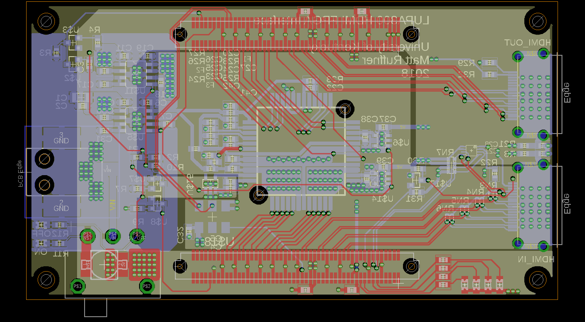
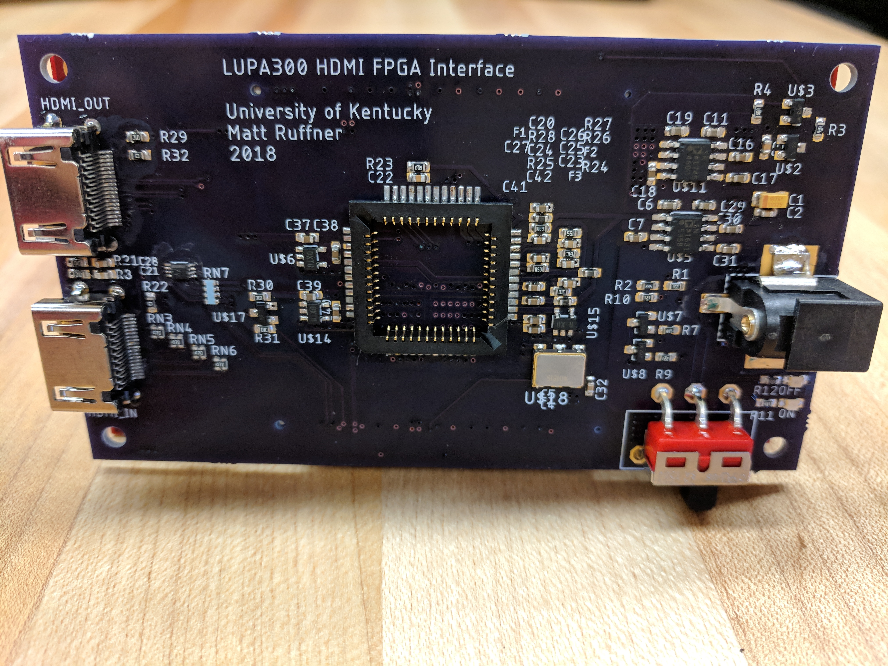
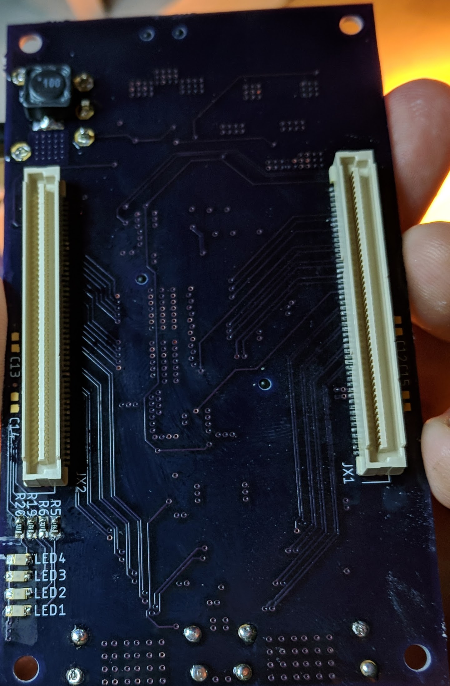
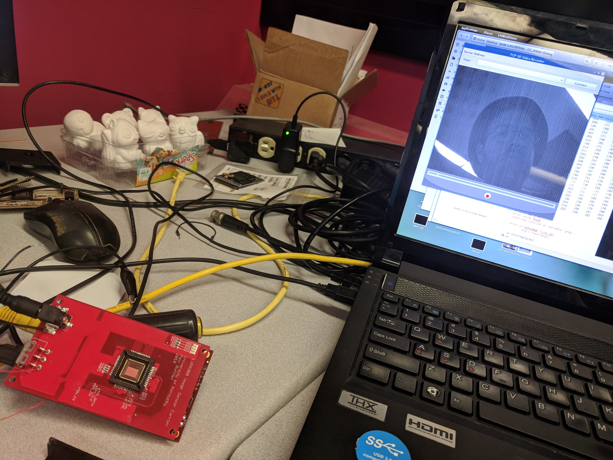
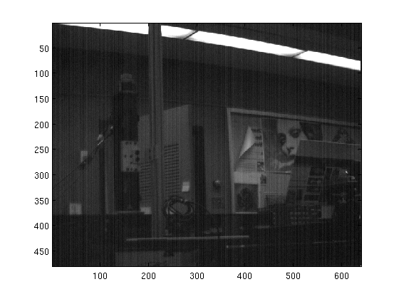
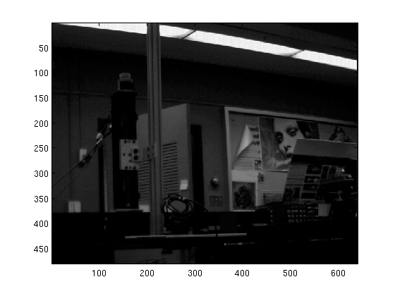
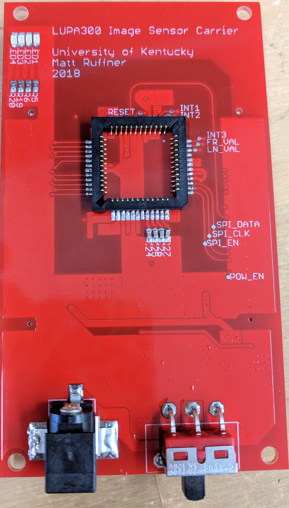

# AR/VR FPGA Controller Camera Interface
## Supported Platforms
Work is currently being done to integrate AR functionality into two main platforms. 
### Zynq7000 SoC 
With custom carrier PCB providing 2xHDMI and a LUPA300 CMOS image sensor. 

### Mojo Board v3
With 2 port HDMI shield and Basler USB3 Camera

## Supplementary Tools
The following pieces of software have been written to interface with and control various aspects of the project

- **[Lupa300Viewer/](https://github.com/ruffner/lupa300/tree/master/Lupa300Viewer)** minimal tcp video streaming client software, for live viewing on PC and recording. The Following image shows the streaming setup with an image shown from the LUPA300 sensor before fixed pattern noise (FPN) correction.

These are two example images from the LUPA300 sensor, both before and after FPN correction.

- **[LAUMicroZedBoard/](https://github.com/ruffner/lupa300/tree/master/LAUMicroZedBoard)** headless Qt video server. Retrieves image sensor data from FPGA via [xillybus](http://xillybus.com/). 
- **[tools/Si514_programmer](https://github.com/ruffner/lupa300/tree/master/tools/si514_programmer)** Provides a serial interface for controlling the frequency of an [Si514 programmable oscillator](https://www.silabs.com/documents/public/data-sheets/Si514.pdf) conncted to an Arduino over i2c.
- **[Cusom MojoV3 Firmware](https://github.com/ruffner/mojo-arduino)** adds support for utilization of the 1024 bytes of EEPROM onboard th ATMega32u4 on the [Mojo](https://alchitry.com/products/mojo-v3). 
- -  [Example Python Uploader](https://github.com/ruffner/lupa300/tree/master/tools/mojo_trigger) in a Jupyter notebook, for uploading eeprom values to the Mojo

### Previous Designs
**Before HDMI Integration**

